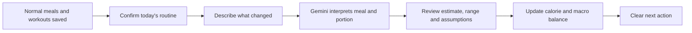

<div align="center">

# 🫀 HealthAI

### Stop logging your whole life. **Just log what changed.**

A routine-first nutrition and workout coach that remembers normal meals, understands deviations with Gemini, and turns the result into one clear next action.

[](https://react.dev/)
[](https://vite.dev/)
[](https://ai.google.dev/)
[](https://vercel.com/new/clone?repository-url=https%3A%2F%2Fgithub.com%2Fabdullahak07%2FHealthApp&env=GEMINI_API_KEY,GEMINI_MODEL)

[](https://vercel.com/new/clone?repository-url=https%3A%2F%2Fgithub.com%2Fabdullahak07%2FHealthApp&env=GEMINI_API_KEY,GEMINI_MODEL)

</div>

---

## The problem

Most health apps make users rebuild every day from zero:

- Search for every food again
- Enter the same breakfast again
- Guess restaurant portions
- Review many charts without knowing what to do next
- Treat one unusual meal as though the entire plan has failed

HealthAI starts from the user’s **normal routine** and asks only what changed.



> **Core product idea:** your routine is the baseline; HealthAI only asks you to report the exception.

---

## What makes it different

| Traditional calorie tracker | HealthAI |
|---|---|
| Log every meal from scratch | Confirm pre-filled normal meals |
| Search a food database manually | Describe the meal naturally |
| Return one generic calorie number | Show an estimate, range, confidence and assumptions |
| Focus on individual entries | Focus on deviation from the normal routine |
| Show totals and charts | Explain what the totals mean next |
| Keep workouts and nutrition separate | Connect food balance with training guidance |

### Intended market wedge

HealthAI is being shaped around **Australian, halal, South Asian and Middle Eastern eating patterns**, where meals are often homemade, shared, restaurant-served or measured by plate, bowl, roti or serving spoon rather than a nutrition label.

The AI estimator is prompted to understand foods such as:

- Biryani, pulao, curry, karahi and haleem
- Roti, naan, paratha and Lebanese bread
- Kebabs, shawarma and halal snack packs
- Australian supermarket and restaurant meals
- Mixed plates where oil, sauces and serving size create uncertainty

---

## Current MVP

### Routine-first daily nutrition

- Pre-filled normal meals
- One-tap meal confirmation
- Extra-food entry in natural language
- Barcode lookup through Open Food Facts
- Calories, protein, carbohydrates and fat tracking
- Browser persistence through `localStorage`

### Gemini food estimation

The user can enter descriptions such as:

```text
pizza 1 slice
one plate chicken biryani with raita
2 rotis with chicken karahi
large halal snack pack with garlic sauce
```

Gemini returns a structured preview containing:

- Interpreted food and serving
- Best calorie estimate
- Plausible minimum and maximum
- Protein, carbohydrates and fat
- Confidence level
- Assumptions affecting accuracy
- Component breakdown for mixed meals
- One clarification question when the entry is too ambiguous

Nothing is added until the user reviews and confirms the estimate.

### Actionable calorie balance

- Mifflin–St Jeor-based calorie targets
- Goal-specific maintenance and weight-loss targets
- Net daily surplus calculation
- Weight-adjusted activity equivalents only when intake is genuinely above target
- Walking, estimated steps, incline treadmill, cycling and jogging options
- No false “burn it off” recommendation when the user remains below target

### Workout system

- Six-day Phase 3 training plan plus recovery day
- Daily exercise checklist
- Sets, repetitions, rest periods, warm-ups and cooldowns
- Workout duration and estimated session calories
- Responsive desktop and mobile views

### Routine import

- PDF workout extraction in the browser
- Image OCR in the browser
- TXT and JSON routine import
- Imported workout days and exercises saved locally

---

## Architecture

```text
Vercel deployment
├── React + Vite frontend
├── /api/food/estimate.js       # Secure Gemini Vercel Function
├── /api/health.js              # Deployment/configuration check
├── Browser localStorage        # Profile, meals, routine and progress
├── PDF.js                      # Local workout PDF extraction
├── Tesseract.js                # Local image OCR
└── Open Food Facts             # Barcode nutrition lookup
```

### API-key security

`GEMINI_API_KEY` is read only inside the Vercel Function through `process.env`.

It is **not**:

- committed to GitHub
- included in the Vite bundle
- exposed through a `VITE_` variable
- sent to the browser

The frontend calls the same-origin endpoint:

```text
POST /api/food/estimate
```

---

## Deploy on Vercel

### Fastest method

1. Click **Deploy with Vercel** above.
2. Connect the `abdullahak07/HealthApp` repository.
3. Add the required environment variable:

```text
GEMINI_API_KEY=your_private_gemini_key
```

4. Optionally set:

```text
GEMINI_MODEL=gemini-3.5-flash
```

5. Press **Deploy**.

Vercel automatically detects the Vite frontend and the files under `/api` as serverless functions.

### Verify the deployment

Open:

```text
https://YOUR-VERCEL-DOMAIN/api/health
```

Expected response:

```json
{
  "ok": true,
  "service": "healthai-vercel-gemini",
  "model": "gemini-3.5-flash",
  "geminiConfigured": true
}
```

Then open the app and confirm the food card shows:

```text
AI connected
```

---

## Run locally with Vercel Functions

### Requirements

- Node.js 20 or newer
- npm
- Vercel CLI

```bash
npm install
npm install --global vercel
vercel dev
```

Create a local `.env` file from `.env.example`:

```text
GEMINI_API_KEY=your_private_gemini_key
GEMINI_MODEL=gemini-3.5-flash
```

Do not commit `.env`.

### Frontend-only development

```bash
npm install
npm run dev
```

The interface will run, but native `/api` functions require `vercel dev`.

### Production verification

```bash
npm run check
```

---

## Project structure

```text
HealthApp/
├── api/
│   ├── food/estimate.js        # Gemini nutrition estimation
│   └── health.js               # Vercel configuration check
├── src/
│   ├── data/                   # Default profile, meals and workouts
│   ├── App.jsx
│   ├── SimpleHomeManagerV4.jsx
│   ├── aiFoodClient.js
│   ├── CalorieOffsetCoach.jsx
│   ├── routineUploadEnhancer.js
│   └── main.jsx
├── .env.example
├── vercel.json
├── vite.config.js
└── package.json
```

---

## Product roadmap

### Next

- [ ] Let users edit Gemini’s serving and macros before confirmation
- [ ] Weekly calorie budget and deviation tracking
- [ ] Multiple correction choices: food, steps, mixed or no action
- [ ] Daily reset and historical food log
- [ ] Export/import user data
- [ ] Improved Australian product and restaurant coverage

### Later

- [ ] Authentication and cloud sync
- [ ] Personal maintenance-calorie learning from weight trends
- [ ] Apple Health and Android Health Connect integration
- [ ] Voice food logging
- [ ] Photo-based meal estimation with confirmation
- [ ] Halal and South Asian food knowledge base
- [ ] Ramadan mode
- [ ] Coach or dietitian review workflow

---

## Accuracy and health notice

HealthAI is a wellness and planning tool, not a medical device.

Food calories vary by brand, portion, ingredients and cooking method. AI estimates can be wrong. Exercise expenditure varies by body composition, pace, fitness, terrain and physiology. Always review the serving, confidence and assumptions before saving an estimate.

Stop exercise and seek appropriate medical advice for chest pain, severe breathlessness, fainting, neurological symptoms, significant injury or worsening pain.

---

## Founder’s product thesis

> The winning health app will not be the one that asks users to track more. It will be the one that understands their normal life, notices what changed, and gives the smallest realistic adjustment needed to stay on course.

<div align="center">

Built by [Abdullah Ahmad Khan](https://github.com/abdullahak07)

**HealthAI — your routine, made measurable.**

</div>
