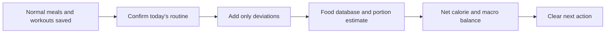

<div align="center">

# 🫀 HealthAI

### Stop logging your whole life. **Just log what changed.**

A routine-first nutrition and workout coach that remembers your normal meals, tracks deviations, and turns the result into one clear next action.

[](https://abdullahak07.github.io/HealthApp/)
[](https://react.dev/)
[](https://vite.dev/)
[](https://abdullahak07.github.io/HealthApp/)

**[Launch the app](https://abdullahak07.github.io/HealthApp/)** · **[View the source](https://github.com/abdullahak07/HealthApp)**

</div>

---

## The problem

Most health apps make users rebuild every day from zero:

- Search for every food again
- Enter the same breakfast again
- Guess restaurant portions
- Review many charts without knowing what to do next
- Treat one unusual meal as though the entire plan has failed

For people who usually repeat the same meals and gym routine, this creates unnecessary work and poor adherence.

## The HealthAI approach

HealthAI starts with the user’s **normal routine already saved**.

Daily use becomes:

1. Tap the planned meals that were eaten.
2. Add only what was different.
3. Let the app calculate the updated daily balance.
4. Receive a practical activity or nutrition adjustment when required.



> **Core product idea:** your normal routine is the baseline; HealthAI only asks you to report the exception.

---

## What makes it different

| Traditional calorie tracker | HealthAI |
|---|---|
| Log every meal from scratch | Confirm pre-filled normal meals |
| Focus on individual food entries | Focus on deviation from the normal routine |
| Show totals and charts | Explain what the totals mean next |
| Treat every day independently | Designed to evolve toward weekly rebalancing |
| Often presents one calorie number as exact | Shows the source and portion assumption for added foods |
| Workout and nutrition live separately | Food balance and training guidance are connected |

### The intended market wedge

HealthAI is being shaped around **real Australian, halal, South Asian and Middle Eastern eating patterns**, where meals are often homemade, shared, restaurant-served or measured by plate, bowl, roti or serving spoon rather than a nutrition label.

The longer-term goal is to support:

- Halal-first food discovery
- Australian supermarket and restaurant products
- Biryani, roti, paratha, karahi, kebab, shawarma and similar meals
- Household portion estimation
- Ramadan-aware suhoor, iftar and workout planning
- Weekly correction choices that protect protein and training performance

---

## Current MVP

### Simple daily nutrition

- Pre-filled normal meals
- One-tap meal confirmation
- Extra-food entry using natural text such as `pizza 1 slice` or `chicken 200 g`
- Live food lookup through USDA FoodData Central
- Barcode nutrition lookup through Open Food Facts
- Local fallback estimates when live data is unavailable
- Calories, protein, carbohydrates and fat tracking
- Food source and assumed portion shown after lookup

### Actionable calorie balance

- Mifflin–St Jeor-based calorie targets
- Goal-specific maintenance and weight-loss targets
- Net daily surplus calculation
- Weight-adjusted activity equivalents when the user is genuinely above target
- Walking, estimated steps, incline treadmill, cycling and jogging options
- No false “burn it off” recommendation when intake remains below the daily target

### Workout system

- Six-day Phase 3 training plan plus recovery day
- Daily exercise checklist
- Sets, repetitions, rest periods, warm-ups and cooldowns
- Workout duration and estimated session calories
- Responsive workout view for desktop and mobile

### Routine import

- PDF workout-plan extraction in the browser
- Image OCR in the browser
- TXT and JSON routine import
- Imported workout days and exercises saved directly into the app
- No workout PDF upload to an application backend in the current MVP

### Progress and profile

- Personal body and activity profile
- BMI, BMR, calorie and macro estimates
- Weight check-ins and trend view
- Goal and activity-level controls
- Browser persistence through `localStorage`

---

## Privacy-first MVP architecture

HealthAI currently runs as a static client-side application.

- No user account is required.
- Profile, meals, routines and progress are stored in the browser.
- Workout PDF parsing and image OCR run locally in the browser.
- No private AI key is embedded in the public repository.
- Clearing site data or changing browser/device removes local data unless export/sync is added later.

```text
Browser
├── React interface
├── Local profile and history
├── PDF.js workout extraction
├── Tesseract.js image OCR
├── USDA food search
└── Open Food Facts barcode lookup
```

---

## Product roadmap

### Next

- [ ] Weekly calorie budget and deviation tracking
- [ ] Multiple correction choices: food, steps, mixed or no action
- [ ] Confidence ranges for uncertain meals
- [ ] Edit and confirm database matches before saving
- [ ] Daily reset and historical food log
- [ ] Export/import user data
- [ ] Improved Australian product and restaurant coverage

### Later

- [ ] Secure backend and authentication
- [ ] Personal maintenance-calorie learning from weight trends
- [ ] Apple Health and Android Health Connect integration
- [ ] Voice food logging
- [ ] Photo-based meal estimation with confirmation
- [ ] Halal and South Asian food knowledge base
- [ ] Ramadan mode
- [ ] Coach or dietitian review workflow
- [ ] Recommendation learning based on user preferences

---

## Technology

| Area | Technology |
|---|---|
| Frontend | React 18 |
| Build tooling | Vite 5 |
| Icons | Lucide React |
| Styling | Custom responsive CSS |
| Persistence | Browser `localStorage` |
| Food data | USDA FoodData Central and Open Food Facts |
| PDF extraction | PDF.js |
| Image OCR | Tesseract.js |
| Hosting | GitHub Pages |
| Deployment | GitHub Actions |

---

## Run locally

### Requirements

- Node.js 20 or newer
- npm

### Installation

```bash
git clone https://github.com/abdullahak07/HealthApp.git
cd HealthApp
npm install
npm run dev
```

Vite will print the local development URL in the terminal.

### Production verification

```bash
npm run check
```

`npm run check` builds the production application and exits with an error if compilation fails.

### Preview the production build

```bash
npm run build
npm run preview
```

---

## Deployment

Every push to `main` is built and deployed through GitHub Actions to:

**https://abdullahak07.github.io/HealthApp/**

The application uses the Vite base path `/HealthApp/` for GitHub Pages compatibility.

---

## Project structure

```text
HealthApp/
├── .github/workflows/       # GitHub Pages deployment
├── src/
│   ├── data/                # Default profile, meals and workout plan
│   ├── App.jsx              # Main application views
│   ├── SimpleHomeManagerV3.jsx
│   ├── CalorieOffsetCoach.jsx
│   ├── routineUploadEnhancer.js
│   ├── styles.css
│   └── main.jsx
├── index.html
├── package.json
└── vite.config.js
```

---

## Accuracy and health notice

HealthAI is a wellness and planning tool, not a medical device.

Food calories vary by brand, portion, ingredients and cooking method. Exercise expenditure varies by body composition, pace, fitness, terrain, equipment and physiology. Database matches and MET-based activity calculations are estimates and must not be presented as exact measurements.

Stop exercise and seek appropriate medical advice for chest pain, severe breathlessness, fainting, neurological symptoms, significant injury or worsening pain.

---

## Founder’s product thesis

> The winning health app will not be the one that asks users to track more. It will be the one that understands their normal life, notices what changed, and gives the smallest realistic adjustment needed to stay on course.

<div align="center">

Built by [Abdullah Ahmad Khan](https://github.com/abdullahak07)

**HealthAI — your routine, made measurable.**

</div>
